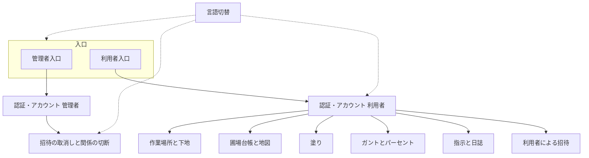

# 基本設計書（第1版）

- 版: 0.1
- 日付: 2026-09-12
- 状態: 基本仕様から落とせる範囲は確定。判断事項は §12 に残し、合意後に改訂する。
- 上位: [要求仕様書.md](要求仕様書.md)、[基本仕様書.md](基本仕様書.md)、[工程表.md](工程表.md)
- 本書は第1版の **基本設計（論理構成）** である。API、テーブル定義、画面のピクセル、色の具体値、ライブラリ名、製品名は詳細設計とし、書かない。
- 本書が描くのは **完成した第1版** である。工程表の「その工程では後工程を出さない」は実装の順番であり、完成形の制約ではない。

## 1. 位置づけ

- 要求の正本は要求仕様書、振る舞いは基本仕様書、作る順は工程表、論理の分け方は本書とする。
- イチセが置くISASは1つである。営農者ごとの別システム、公開SaaS、誰でも登録は持たない。
- プログラム言語、データベース、地図の描画部品の名前は、工程の着手時にその工程で迷う分だけ決める。本書では決めない。
- 対象外（農機、GAP、在庫、オフライン、通知、写真、印刷、Excel、公開登録、RTL 等）の置き場所は設けない。

## 2. システムの分け方

完成した第1版は、次の論理ブロックに分ける。1つのWebアプリケーションとして置き、入口だけ管理者と利用者で分ける。



| ブロック | 役割 |
|---|---|
| 入口 | 管理者と利用者で別のログイン。未ログインの保護画面は、その側の入口へ進む。 |
| 認証・アカウント | メールアドレスとパスワード。初期パスワードの発行、本人の変更、メールによる再設定、ログアウト。 |
| 運用 | 管理者だけが行う。招待の取消しと、利用者同士の関係の切断。圃場・地図・ガントは持たない。 |
| 作業場所と下地 | 利用者に1つの作業場所。その範囲の下地画像3種。自分の地図を開いた初期位置と既定下地。 |
| 圃場台帳と地図 | 自分の圃場の名前と形。手描き、取込、分割、合筆、削除。パソコン。 |
| 塗り | 圃場 × 作業名の完了範囲。実績の正本。所有者のパソコンだけ。 |
| ガントとパーセント | 自分用の予定。選んだ行の面積％と地図色。パソコン。指示とは繋がない。 |
| 指示と日誌 | 他人への依頼票と、受け手の「やった」記録。スマホは進捗色と日誌。 |
| 言語切替 | 画面文言の日英。データは訳さない。 |

パソコンとスマホは別アプリにしない。同じ利用者アカウントで、ブラウザの幅に応じて役割を変える。

- パソコン: 台帳、地図の編集、塗り、ガント、指示の作成と閉じ、日誌の確認、招待。
- スマホ: 受けた／出した指示の対象圃場の進捗色、受けた指示への日誌。塗り・境界・下地取込・ガント編集は持たない。

## 3. アクターと権限

アカウントの種別は2つだけとする。互いに転用しない。同じメールアドレスを両方に置かない。

| 操作 | 管理者 | 利用者（圃場1枚以上） | 利用者（圃場0枚） |
|---|---|---|---|
| 管理者入口から入る | 可 | 不可 | 不可 |
| 利用者入口から入る | 不可 | 可 | 可 |
| 利用者を招待する | 可 | 可 | 可 |
| 招待を取り消す | 可 | 不可 | 不可 |
| 関係を切る | 可（進行中の指示がある相手は不可） | 不可 | 不可 |
| 作業場所・下地・自分の圃場 | 持たない | 可 | 作業場所は可。圃場が無いので塗り・ガント・指示の作成は不可 |
| 塗る | 不可 | 自分の圃場のみ | 不可 |
| ガント | 不可 | 可 | 不可（1枚以上になれば、残っている行を使える） |
| 指示を出す | 不可 | 可（自分の圃場、自分は受け手にしない） | 不可 |
| 指示を受ける・日誌 | 不可 | 可 | 可 |
| 他人の対象圃場の進捗色 | 見ない | 指示で対象になった枚だけ | 同左 |

管理者は、このISASを置くときに利用者とは別に用意する。画面から管理者を増やす手段は持たない。招待で増えるのは利用者だけである。

## 4. 機能の塊

### 4.1 認証

- 識別子はメールアドレスとする。任意のログインIDは持たない。
- 招待時にシステムが初期パスワードを作り、招待した人の画面にその場で出す。あとから同じ文字列は出さない。相手への連絡はシステムの外とする。忘れた人はパスワード再設定を使う。
- 再設定は、管理者入口と利用者入口で別とする。案内メールは再設定のときだけ送る。招待案内メールは送らない。
- 取り消された利用者は、再設定しても入れない。
- 失敗理由を細かく分けることは第1版の必須としない。

### 4.2 作業場所と下地

- 作業場所は利用者に1つとする。自分の地図を開いた位置の正とする。圃場の枚数や広がりでは動かさない。
- 下地は、その作業場所の範囲について利用者が取り込む画像3種（標準地図／空中写真／衛星）とする。管理者が配らない。
- 既定の下地は空中写真とする。
- 作業場所を変えたときは、新しい範囲の3種を取り込む。古い範囲の下地は使わない。
- 未設定のときは、作業場所を定めてから自分の地図を使う。ログイン可否は変えない。
- 作業場所の定め方は §12 の判断1とする。
- 国土地理院タイルは直接出さない。農地ナビの画面は埋め込まない。画面キャプチャを下地に貼らない。

### 4.3 圃場

- 1枚は名前と閉じた形を持つ。面積は形から求める。手入力の面積は持たない。
- 一覧は ha、詳細は ㎡ とする。
- 同じ利用者の中で名前の重複と形の重なりを許す。点や線だけで面積が取れない形は保存しない。
- 分割するとそれぞれが台帳の圃場になる。仮の名前を付け、あとで直せる。
- 合筆後の名前は残す側の名前とし、あとで直せる。
- いずれかの作業名の塗りが残っている圃場は、分割も合筆もできない。
- 所有者が削除できる。ガント行の対象からは外す。
- 作物・地番・所有者欄は持たない。
- 目安は一人あたりおおよそ150枚である。これを超えたら保存できない、とは第1版で決めない。

### 4.4 作業名と塗り

- 作業名のマスタは持たない。文字列である。前後の空白だけ除き、完全一致で束ねる。改名はしない。
- 入力候補は、その利用者が塗り・ガント・指示に使った名前とする。他人の名前は出さない。塗りが残っている名前は、履歴から消せない。
- 塗りは確定したポリゴンだけを正本とする。ブラシの下書きは破棄できる。
- 同じ圃場・同じ作業名に複数の塗りを置ける。面積は合わせ、重なりは二重に数えない。圃場の外側は数えない。
- 全面完了は、その圃場のその作業名の塗りを圃場の形全体にする。
- 確定した塗りは1つずつ消せる。その圃場・その作業名を全部消して未に戻せる。
- 助っ人は塗れない。見える相手の圃場でも塗れない。

### 4.5 進捗色とパーセントサークル

進捗色は次の3つとする。色の具体値は詳細設計とする。

| 状態 | 意味 |
|---|---|
| 未 | その作業名の塗り面積が0 |
| 一部 | 0より大きく、圃場面積より小さい |
| 済 | 全面完了した、または塗り面積が圃場面積に達した |

- 自分の地図を開いたときは作業名未選択とし、形だけ出す。前回の選択は残さない。
- 地図側で作業名を選ぶと、自分の全圃場にその作業名の色を付ける。
- 対象付きのガント行を選んでいるあいだは、ガント側を優先する。対象圃場は上記の色、他の自分の圃場は薄い色とする。
- パーセントサークルは、選択中のガント行1つにだけ付ける。分母は対象圃場の合計面積、分子はその作業名の塗り面積の合計。枚数では割らない。分子は分母を超えない。
- メモ行、対象圃場が無い行、行未選択ではサークルを出さない。
- 日誌に書いた％は記録だけとし、色もサークルも動かさない。

### 4.6 ガント

- 行は題名、開始日時、終了日時、作業名、対象圃場を持てる。開始・終了は時刻までとする。
- 対象がある行は作業名必須。対象も作業名も無い行、および作業名だけある行はメモとし、％を付けない。
- 行は削除できない。時刻・題名・作業名・対象は直せる。重なりは許す。
- 横軸の初期は、今日を含む数日で時刻が読める範囲とする。週や月へ広げることはできる。
- 指示と行番号でも作業名でも自動では繋がない。

### 4.7 指示・日誌・関係

- 1件の指示は、日付、開始・終了時刻、作業名、依頼文、受け手1人以上、出した人の圃場1枚以上を持つ。
- 閉じる前は依頼文と時刻（日付を含む）だけ直せる。受け手と対象圃場は変えない。
- 出した人が手で閉じる。日誌が無くても閉じられる。再開しない。閉じは削除ではない。
- 日誌は指示1件につき受け手1人1通。任意。書いたら直せない。閉じたあとは書けない。圃場内訳は持たない。
- 一度対象になった相手の圃場だけが、以降も見える。載っていなかった枚は見えない。見える枚には、関係した指示の作業名について所有者の塗り色を出す。
- ログイン直後の地図の主は自分の圃場とする。
- 関係の切断は管理者だけとする。出した人も受け手も切れない。切ると相手の圃場は見えなくなる。指示と日誌の記録は残す。同じ相手へ新しい指示を出せば、その対象は再び見える。
- 進行中（まだ閉じていない指示）がある相手は、管理者も切れない。切断の単位は §12 の判断3とする。
- 指示の進捗を見る画面での地図位置は §12 の判断2とする。

### 4.8 言語

- 切替えるのはボタン、見出し、案内、日付の出し方、単位のラベルである。
- 圃場名、作業名、日誌、依頼文、題名、メールアドレス、ha と ㎡ の数値、塗りと％の数値は訳さない。
- 最初に出す言語は日本語とする。
- ログイン前の切替は、その入口を読んでいる間だけとする。パスワード再設定も同じ。
- ログイン後はアカウントに残し、別の端末でも同じにする。未設定のアカウントは日本語。入口で英語にして入っても、アカウントが日本語なら日本語にする。
- 管理者の画面も対象とする。

## 5. 画面の役割

レイアウトは定めない。第1版で必要な役割だけを置く。

### 5.1 未ログイン

| 役割 | 誰向け | すること |
|---|---|---|
| 管理者ログイン | 管理者 | メールアドレスとパスワードで入る。日英切替。 |
| 利用者ログイン | 利用者 | 同上。管理者とは入口が違う。 |
| 管理者のパスワード再設定 | 管理者 | 案内メールを管理者アドレスへ送る。 |
| 利用者のパスワード再設定 | 利用者 | 案内メールを利用者アドレスへ送る。 |

公開の新規登録画面は置かない。

### 5.2 管理者（ログイン後）

| 役割 | すること |
|---|---|
| 招待 | メールアドレスを指定して利用者を増やす。初期パスワードをその場で見せる。 |
| 招待の取消し | 取り消されていない利用者を、以後入れなくする。 |
| 関係の切断 | 進行中の指示が無い相手について、関係を切る。 |
| パスワード変更 | 本人のパスワードを変える。 |
| 言語切替 | 画面文言。選んだ言語は管理者アカウントに残す。 |

地図、台帳、ガント、指示、日誌の役割は置かない。

### 5.3 利用者・パソコン

| 役割 | すること |
|---|---|
| 作業場所と下地 | 作業場所を定める／変える。3種の画像を取り込む。下地を切り替える。 |
| 圃場台帳 | 名前と面積の一覧。詳細は ㎡。削除。 |
| 地図（自分の圃場） | 手描き、修正、分割、合筆、区画取込、塗り、全面完了、作業名による色。初期は作業場所の空中写真。 |
| ガント | 行の作成と時刻等の編集。削除はしない。対象付き行の％と色。 |
| 指示 | 作成、閉じる前の依頼文・時刻の修正、閉じる、出した／受けた指示の確認、日誌の確認。 |
| 他人の対象圃場 | 指示で対象になった枚の形と、関係した作業名の進捗色。塗れない。 |
| 招待 | 利用者を招待する。取消しは無い。 |
| パスワード変更 | 本人のパスワードを変える。 |
| 言語切替 | 選んだ言語は利用者アカウントに残す。 |

圃場が0枚のときは、ガントと指示の作成と塗りを出さない（または使えなくする）。台帳と地図と作業場所は開ける。

### 5.4 利用者・スマホ

| 役割 | すること |
|---|---|
| 受けた指示 | 対象圃場の進捗色を見る。閉じる前なら日誌を1通書ける。 |
| 出した指示 | 対象圃場の進捗色を見る。日誌は書けない。 |
| 言語切替 | パソコンと同じアカウントの言語。 |

塗り、境界、下地取込、ガント編集、指示の作成と閉じは持たない。パーセントサークルはガント行の選択に付くものなので、スマホには置かない。進捗は色で見る。

## 6. データの考え方

保存の製品名とテーブル定義は書かない。第1版が持つ情報の単位と関係だけを定める。

```mermaid
erDiagram
  管理者アカウント ||--o{ 招待 : 行うことがある
  利用者アカウント ||--o{ 招待 : 行うことがある
  利用者アカウント ||--o| 作業場所 : 1つ
  作業場所 ||--o{ 下地画像 : 3種
  利用者アカウント ||--o{ 圃場 : 所有
  圃場 ||--o{ 塗り : 圃場×作業名
  利用者アカウント ||--o{ ガント行 : 自分用
  ガント行 }o--o{ 圃場 : 対象
  利用者アカウント ||--o{ 指示 : 出す
  指示 }o--o{ 利用者アカウント : 受け手
  指示 }o--o{ 圃場 : 対象
  指示 ||--o{ 日誌 : 受け手1人1通
  利用者アカウント }o--o{ 利用者アカウント : 関係による見え方
```

| 単位 | 持つもの | 持たないもの |
|---|---|---|
| 管理者アカウント | メールアドレス、パスワード、UI言語 | 作業場所、圃場 |
| 利用者アカウント | メールアドレス、パスワード、UI言語、作業場所、招待の取消し状態 | 管理者権限 |
| 作業場所 | その利用者の見る位置と範囲 | 圃場ごとの位置 |
| 下地画像 | 標準／空中写真／衛星の3種。作業場所の範囲 | 地理院のライブタイル |
| 圃場 | 所有者、名前、閉じた形、形から求めた面積 | 作物、地番、所有者欄、手入力面積 |
| 塗り | 圃場、作業名、確定ポリゴン、面積 | 下書き、日誌％ |
| ガント行 | 題名、開始・終了、作業名、対象圃場 | 削除フラグを正にした消す操作、指示との紐づけ |
| 指示 | 日付、時刻、作業名、依頼文、受け手、対象圃場、進行中／閉じた | ガント行番号、再開 |
| 日誌 | 指示、書いた受け手、内容 | 訂正、2通目、圃場内訳 |
| 関係による見え方 | どの利用者に、どの相手のどの圃場が見えるか（指示の対象になったことによる） | 全圃場の公開 |

作業名は独立した台帳にしない。各塗り・ガント行・指示が文字列として持つ。一致は前後空白を除いた完全一致である。

面積は保存した形からいつでも求められる。利用者が面積だけ直して形と食い違う状態は作らない。

## 7. 主な流れ

### 7.1 招待して入る

1. 管理者または利用者が、相手のメールアドレスを指定して招待する。
2. システムが初期パスワードを作り、招待した人の画面に出す。
3. 招待した人が、システムの外で相手にメールアドレスと初期パスワードを伝える。
4. 相手は利用者入口から入り、必要ならパスワードを自分で変える。
5. 管理者が取り消すと、以後その人は利用者として入れない。

### 7.2 自分の地図を載せる

1. 利用者が作業場所を定め、その範囲の下地3種を取り込む。
2. 自分の地図は作業場所の空中写真で開く。
3. 手描きまたは区画ファイルの取込で圃場を載せ、名前を付け、境界を直す。
4. 分割・合筆・削除は、塗りが残っていない圃場で行う。

### 7.3 塗って進捗を見る

1. 所有者がパソコンで作業名を選び、ブラシを確定して塗る。または全面完了する。
2. 同じ圃場の「田植え」と「田植」は別の塗りとして残る。
3. ガント行に対象と作業名を付けて選ぶと、％と色がその塗りと一致する。
4. ガントが無くても、塗りは実績として残る。

### 7.4 助っ人に頼む

1. 圃場を持つ利用者が、招待済みの相手を受け手にし、自分の圃場を対象にして指示を出す。
2. 受け手はスマホで、その対象の進捗色を見る。任意で日誌を1通書く。
3. 所有者はパソコンで地図を塗る。日誌が無くても指示を閉じられる。
4. 自分だけで塗る流れは、指示が無くても 7.2〜7.3 のまま動く。

### 7.5 関係を切る

1. 管理者が、進行中の指示が無い二人（または一方向。§12 判断3）を切る。
2. 相手の圃場は見えなくなる。指示と日誌の記録は残る。
3. 新しい指示の対象になった枚は、再び見える。

### 7.6 日英を切替える

1. 未ログインでは入口の表示だけが変わる。
2. ログイン後に切替えるとアカウントに残り、別の端末でも同じになる。
3. 作業名と塗りと％は数値も形も変わらない。

## 8. 外部との境

| 相手 | 第1版での扱い |
|---|---|
| eMAFF 農地ナビ／筆ポリゴン | 形と下地画像の入手元。利用者がシステム外で取得し、ISASに取り込む。ISASは農地ナビを呼び出さない・埋め込まない。 |
| 国土地理院 | タイルを直接表示しない。 |
| メール | パスワード再設定の案内だけ送る。招待は送らない。 |
| 外部の認証サービス | 使わない。 |
| 農機・他営農システム | 繋がない。 |

取込ファイルの拡張子や画像形式の細部は詳細設計とする。基本仕様どおり、区画は GeoJSON 等、複数ポリゴンは1枚ずつ圃場にする。

## 9. 非機能（第1版で守ること）

- オンライン必須。圏外の下書きは持たない。
- 一人あたりおおよそ150枚で、台帳・地図・塗り・ガントの操作が成立すれば足りる。
- パソコンとスマホで同じアカウントに入れる。同時に入れることは妨げない。
- 運用マニュアルと本番多重化は、第1版の必須にしない。
- 画面文言は日本語と英語だけとする。

## 10. 工程との対応

本書の論理ブロックを、工程表の順で実現する。先のブロックを「ついで」に作らない。

| 工程 | 実現するブロック |
|---|---|
| 1 | 入口、認証・アカウント、利用者による招待。ログイン後は入ったことが分かれば足りる。運用のうち招待の取消し。言語切替の本機能はまだ置かない。 |
| 2 | 作業場所と下地、圃場台帳と地図（自分の圃場、パソコン）。 |
| 3 | 塗り、地図側の作業名色。 |
| 4 | ガントとパーセント。 |
| 5 | 指示と日誌、関係による見え方、管理者の関係切断、スマホの役割。 |
| 6 | 言語切替。工程1〜5を実データで受入する。 |

## 11. 詳細設計に送るもの

次は本書では決めない。

- 画面の配置、部品の見た目、色の具体値
- API、データベースの表、ファイルの置き場所
- 地図ライブラリ、認証の保存の仕方、メール送信の製品
- 取込ファイルの形式の細部、面積計算の実装
- セッションの長さ、同時接続数
- 翻訳文面の一覧

## 12. 判断待ち

次は基本仕様に書き切っておらず、基本設計を閉じるために決める。決まったら本書を改訂する。

1. **作業場所の定め方。** 利用者が作業場所を「指定する」ことは決まっている。地図上で見る位置と範囲を自分で決めるのか、住所や地名を入れるのか。
2. **指示の進捗を見るときの地図位置。** 自分の地図の初期位置は作業場所である。スマホ等で指示の対象圃場を見るとき、対象が見える位置にするのか、作業場所のまま自分で動かすのか。
3. **関係の切断の単位。** 二人のあいだを双方向で切るのか、出した人から受け手への一方向だけ切るのか。圃場ごとに切ることは、基本仕様の「関係」とは合わないので候補にしない。
